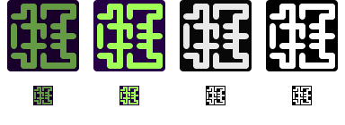
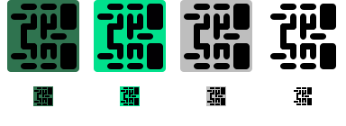
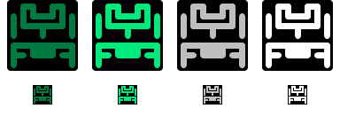
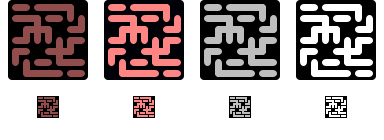

# BitSquiggles

BitSquiggles is an experimental family of visual encodings for comparing two
already-derived short fingerprints or checksums. It turns the same value into
the same compact pattern on different devices, including devices with very
small or monochrome displays.

BitSquiggle32 accepts a 32-bit value and uses a 7×5 grid. BitSquiggle40 accepts
a 40-bit value and uses a 7×7 grid.

The intended interaction is a side-by-side check: show the pattern on both
devices and look for a difference. A typical example is comparing a BIP-32
master-key fingerprint shown by a hardware wallet with the fingerprint shown
by its companion application (32bit variant) or eight 5-bit characters of a
BIP380 descriptor checksum (40bit variant).

The project provides dependency-free reference implementations for Java 17,
MicroPython-compatible Python, JavaScript, C99, and Dart. Java,
MicroPython-compatible Python, and C99 support both BitSquiggle32 and
BitSquiggle40; JavaScript and Dart currently support BitSquiggle32. The
algorithms and
conformance requirements are defined in [SPEC.md](SPEC.md); this README
deliberately stays at the project and design-rationale level.

## Rendered examples

Each BitSquiggle32 sheet below is generated directly from the Java reference implementation.
The four columns are Standard, High Contrast, Monochrome, and Black and White.
Every column contains an 80×110 smooth rendering above its native, unscaled
16×22 pixel raster. The color changes between styles; the encoded geometry does
not.

**Try any value in the [interactive playground](https://maggo83.github.io/BitSquiggles/).**
It runs entirely in the browser and creates a shareable link for each value.

| Input | Representative behavior | Rendered styles and native rasters |
| --- | --- | --- |
| `00000000` | Accepted half-turn (`A+`) |  |
| `00000001` | Half-turn capacity fallback to `A\|` |  |
| `00000003` | Accepted slash copy (`A/`) |  |
| `00000004` | Accepted top/bottom copy (`A-`) |  |
| `12345678` | Sparse left/right output (`A\|`) |  |
| `ffffffff` | Denser left/right output (`A\|`) |  |

BitSquiggle40 uses a square 7x7 graph and a 22x22 exact raster. Its fixed
center marker makes the intended orientation explicit.

| 40-bit input | Rendered styles and native rasters |
| --- | --- |
| `0000000000` |  |
| `0000000001` |  |
| `39527804db` |  |
| `ffffffffff` |  |

## Quick start

Choose the target language in the [reference implementation guides](#reference-implementation-guides).
Each guide is the single source for its installation, application API, exact-raster,
optional-renderer, and test instructions.

## Why this project exists

Eight hexadecimal digits or eight descriptor-checksum characters are compact
but tiring to compare, especially on a small screen. BitSquiggles explores
whether a structured visual can make accidental mismatches easier to notice
without requiring color, antialiasing, or a large display.

It is useful when all of the following are true:

- a protocol or application already has a meaningful 32-bit or 40-bit value;
- the same value can be displayed independently in two places;
- a person can inspect both displays at roughly the same time;
- the goal is convenient detection of accidental mismatch.

BitSquiggles does not decide what should be fingerprinted or checksummed.
Deriving and converting the correct input remains the caller's responsibility.

## Intended audience and uses

BitSquiggles is primarily for:

- hardware-wallet and companion-application developers;
- embedded-device developers working with low-resolution displays;
- researchers and designers experimenting with human comparison of short
  fingerprints;
- applications that want an additional visual cue alongside the underlying
  fingerprint.

The patterns are designed for equality comparison, preferably side by side.
They are not designed for recognizing an identity from memory or finding one
identity in a large collection.

## Non-goals and unsafe uses

### Not protection against a deliberate attacker

The input contains only 32 or 40 bits. A targeted collision may be feasible,
regardless of how those bits are displayed. BitSquiggles is not a cryptographic
authentication mechanism and must not be treated as one.

A random value matches one fixed value with probability $1/2^{32}$ for
BitSquiggle32 or $1/2^{40}$ for BitSquiggle40. That may be useful for detecting
accidents, but it is not an adequate security boundary against an attacker who
can search for inputs.

### Not a replacement for complete identifiers

Do not reduce a Bitcoin address, payment destination, public key, transaction,
or other long identifier to 32 bits and then use BitSquiggles as the authorization
decision. Different identifiers can have the same short fingerprint or checksum
and will then correctly produce the same pattern.

Payment destinations and other security-sensitive identifiers still require
an appropriate exact or authenticated comparison of the complete value. A
BitSquiggle can only be an additional cue.

### Not a hash, checksum, or fingerprint derivation function

Each BitSquiggle variant accepts an unsigned integer of its named width. It does not:

- accept arbitrary strings or byte arrays;
- derive BIP-32 or other protocol fingerprints;
- calculate or verify BIP380 descriptor checksums; the BitSquiggle40 helper
  only converts eight already-derived checksum characters to an integer;
- prove possession of a key;
- add information that was discarded before the value reached the encoder;
- provide cryptographic collision resistance.

## Design assumptions and choices

The design is guided by the following assumptions. These are rationale, not a
substitute for the normative rules in [SPEC.md](SPEC.md).

### Geometry carries identity

The pattern remains unambiguous as a pure Black and White rendering. Hue,
chroma, and non-binary lightness are optional, redundant comparison cues rather
than part of the uniqueness argument. This also limits the effect of display
clipping, desaturation, quantization, or inversion: when those cues are not
available, the complete black-and-white image is sufficient.

### Structure is easier to compare than visual noise

The visualization uses connections in a small cell grid and several structured
copy families. Connections provide enough capacity to retain the full input,
while reflection-like, rotation-like, and diagonal copy structures give the
eye larger features to compare. Independent ternary cell states were rejected
because their small subpatterns were difficult to distinguish on real
low-resolution displays.

### Diffusion must not discard information

Nearby numeric inputs should not lead to nearby-looking outputs. Each variant
uses a reversible width-matched mixer rather than a many-to-one hash: it
improves avalanche while preserving the size and uniqueness of the input domain.

### Invisible metadata cannot establish uniqueness

The internal copy-family choice is not printed into the pattern, and different
families can produce the same geometry. Both variants resolve such overlaps by
a canonical priority rule and a full-capacity fallback. Uniqueness is claimed for
the visible connection geometry, not for a hidden mode label.

### A tiny exact rendering is the portability baseline

The conformance representation is a fixed binary raster with no antialiasing.
Each connection has dedicated pixels, allowing the abstract geometry to be
recovered from the raster. Larger smooth renderings are presentation options;
they do not redefine the encoded value.

### Orientation is explicit

Canonical output has a top and a left edge. BitSquiggle40 reserves the four
connections incident to its center cell as an orientation marker: the upward
connection is selected and the other three are clear. Consequently, rotating a
BitSquiggle40 by 90, 180, or 270 degrees cannot turn it into the valid pattern
for a different input. This does not make rotated output canonical, and it does
not provide the same protection against reflection or arbitrary coordinate
permutations.

### Reference implementations should be easy to audit and port

The Java, Python, and JavaScript cores use no third-party runtime dependencies.
They follow the same specification and share conformance coverage. This favors
transparent, portable code over framework integration.

## History

BitSquiggles was inspired by
[Hallmarks](https://github.com/GBKS/hallmarks). Early experiments sought more
visual diversity on small screens and clearer patterns in monochrome pixel
renderings.

The initial idea was broader address verification. Discussion and prototyping
made the underlying limitation clear: a 32-bit visual cannot securely stand in
for a full address, and secure address verification also needs a trustworthy
communication or authentication path. The project was consequently narrowed
to convenient comparison of an already-defined short fingerprint.

Further iterations moved information from independent cells to connections,
introduced reversible mixing, and added canonical handling of overlapping copy
families.

Thanks go out to Christoph Ono for starting Hallmarks and early exchange,
Francis Pouliot for enthusiastic feedback, and Kevin Loaec and Orangesurf
for the critique and pointers to existing other approaches like LifeHash!

## Status

BitSquiggles is **experimental**. The project has tagged its first
BitSquiggle32 reference release, `v0.1.0-beta.1`, so beta testers and potential
collaborators have a stable, citable point to integrate against. This is a
beta: encoding details may still evolve based on integration feedback before a
stable 1.0.

Current state:

- BitSquiggle32 and BitSquiggle40 share one normative specification structure;
- Java 17, MicroPython-compatible Python, and C99 implementations are present
  for both variants;
- JavaScript and Dart BitSquiggle32 implementations are present;
- Java-generated fixtures cover both variants for cross-port conformance;
- each implementation includes a dependency-free test suite;
- the BitSquiggle32 implementations share a documented conformance vector and
  generated fixture;
- uniqueness of the canonical connection mask is supported by a structural
  proof, while tests sample the implementation over large input sets;
- the Java implementation includes an interactive Swing demo;
- optional Swing/Java2D and JavaFX desktop renderers are available;
- the Python port includes an optional PyQt6 exact-raster and smooth renderer;
- the MicroPython port includes optional LVGL exact-raster and smooth renderers;
- the C99 port includes a generic fill-rectangle exact-raster renderer;
- the Dart port includes an optional Flutter exact-raster and smooth renderer;
- proof-of-concept integrations have been verified in simulators for Sparrow,
  Bitcoin Safe, Bull Bitcoin, BitBox, ColdCard, and Specter, and the Specter
  integration has additionally been verified on physical hardware; see
  [PoC integration branches](#poc-integration-branches) for fork and branch
  references;
- no independent security, cryptographic, accessibility, or usability review
  has been completed;
- no controlled user study has established how reliably people notice
  differences;
- smooth scaling, display defects, and human perception can still make two
  distinct patterns difficult to distinguish.

The mathematical uniqueness property should not be confused with a usability
or security guarantee.

Release versioning and publication requirements are defined in
[RELEASING.md](RELEASING.md); released changes are recorded in
[CHANGELOG.md](CHANGELOG.md).

### PoC integration branches

This table is the single source for proof-of-concept integration links,
referenced from [CHANGELOG.md](CHANGELOG.md). Each branch lives on the
maintainer's personal fork, is not an upstream pull request, and does not
indicate upstream project endorsement. Unless noted, a branch was validated in
the project's own simulator or desktop build, not on physical hardware.

| Project | Official repository | PoC fork and branch | Verification |
| --- | --- | --- | --- |
| Sparrow | [sparrowwallet/sparrow](https://github.com/sparrowwallet/sparrow) | [maggo83/sparrow @ feature/bitsquiggles-conformance](https://github.com/maggo83/sparrow/tree/feature/bitsquiggles-conformance) | Simulator/desktop build |
| Bitcoin Safe | [andreasgriffin/bitcoin-safe](https://github.com/andreasgriffin/bitcoin-safe) | [maggo83/bitcoin-safe @ bitsquiggles-conformance](https://github.com/maggo83/bitcoin-safe/tree/bitsquiggles-conformance) | Desktop build |
| Bull Bitcoin | [SatoshiPortal/bullbitcoin-mobile](https://github.com/SatoshiPortal/bullbitcoin-mobile) | [maggo83/bullbitcoin-mobile @ bitsquiggles-conformance](https://github.com/maggo83/bullbitcoin-mobile/tree/bitsquiggles-conformance) | Simulator |
| BitBox02 | [BitBoxSwiss/bitbox02-firmware](https://github.com/BitBoxSwiss/bitbox02-firmware) | [maggo83/bitbox02-firmware @ bitsquiggles-conformance](https://github.com/maggo83/bitbox02-firmware/tree/bitsquiggles-conformance) | Simulator |
| Coldcard | [Coldcard/firmware](https://github.com/Coldcard/firmware) | [maggo83/firmware @ bit-squiggle-poc](https://github.com/maggo83/firmware/tree/bit-squiggle-poc) | Simulator |
| Specter | [cryptoadvance/specter-diy](https://github.com/cryptoadvance/specter-diy) | [maggo83/specter-playground @ feature/bitsquiggles-conformance](https://github.com/maggo83/specter-playground/tree/feature/bitsquiggles-conformance) | Simulator and physical hardware |

## Keeping examples synchronized

The SVG sheets are generated files, not hand-maintained screenshots. After
cloning, enable the repository hook once:

```bash
git config core.hooksPath .githooks
```

The hook regenerates and stages the gallery during each commit. To regenerate
it manually after changing rendering behavior, run:

```bash
mkdir -p out/core
javac -d out/core java/core/module-info.java \
  java/core/bitsquiggles/BitSquiggles.java \
  java/core/bitsquiggles/internal/BitSquigglesCore.java \
  java/core/bitsquiggles/GalleryGenerator.java \
  java/core/bitsquiggles/ConformanceFixtureGenerator.java
java --module-path out/core --module io.github.maggo83.bitsquiggles/bitsquiggles.GalleryGenerator
java --module-path out/core --module io.github.maggo83.bitsquiggles/bitsquiggles.ConformanceFixtureGenerator
```

GitHub Actions also verifies the gallery on every push and pull request. The
`Verify generated gallery` workflow should be configured as a required status
check for `main`, so stale documentation cannot be merged if a local hook was
not enabled.

## Reference implementation guides

Every port guide uses the same headings: status and scope, include/install,
create a BitSquiggle, exact-raster rendering, optional smooth rendering,
conformance testing, package/release notes, and limitations/compatibility.

| Port | Primary targets | Guide |
| --- | --- | --- |
| Java | Java 17+ | [Java guide](java/README.md) |
| Python | CPython and MicroPython | [Python and MicroPython guide](micropython/README.md) |
| JavaScript | Browser, Node, and TypeScript consumers | [JavaScript and TypeScript guide](web/README.md) |
| C99 | Native and embedded C99 consumers | [C99 guide](c/README.md) |
| Dart | Dart and Flutter applications | [Dart and Flutter guide](dart/README.md) |

The canonical identity and rendering requirements are defined once in the
[specification](SPEC.md).

## Repository guide

```text
README.md                  project purpose, audience, rationale, and status
SPEC.md                    normative specification index and reading paths
spec/                      focused normative algorithm, output, API, and validation chapters
CONTRIBUTING.md            contribution workflow and validation expectations
AGENTS.md                  concise guide for coding agents
RELEASING.md               shared versioning and release procedure
CHANGELOG.md               released and planned change history
java/core/
  module-info.java          Shared model/internal implementation descriptor
  bitsquiggles/
    BitSquiggles.java        Neutral public renderer model
    internal/BitSquigglesCore.java
                            Internal generic 32/40-bit reference implementation
    BitSquigglesCoreTest.java Both-width conformance and property tests
    BitSquigglesDemo.java    Java Swing demonstration
    GalleryGenerator.java    Both-width README example-sheet generator
    ConformanceFixtureGenerator.java Both-width cross-language fixture generator
java/renderer-swing/        Optional Swing/Java2D renderer JPMS module
  bitsquiggles/renderer/swing/BitSquigglesRendererSwing.java
                            Shared renderer with explicit 32/40-bit methods
java/renderer-javafx/       Optional JavaFX renderer JPMS module
  bitsquiggles/renderer/javafx/BitSquigglesRendererJavaFX.java
                            Shared renderer with explicit 32/40-bit methods
java/README.md              Java integration and rendering guide
c/
  bitsquiggles_core.h       Shared C99 32/40-bit core API
  bitsquiggles_core.c       Shared C99 32/40-bit implementation
  bitsquiggles_renderer_framebuffer.h One-include application facade
  bitsquiggles_renderer_framebuffer.c Generic exact-raster renderer
  generate_packed_tables.py Design-time packed-table generator
  test_bitsquiggles_core.c  32/40-bit conformance and property tests
  test_bitsquiggles_renderer_framebuffer.c Both-width renderer facade tests
  README.md                 C99 integration guide
dart/
  bitsquiggle32.dart        Dependency-free Dart core
  bitsquiggles_renderer_flutter.dart Optional Flutter exact-raster and smooth renderer
  test_bitsquiggle32.dart   Dart conformance and shared-fixture tests
  README.md                 Dart and Flutter integration guide
micropython/
  bitsquiggles_core.py     Shared MicroPython-compatible 32/40-bit core
  generate_packed_tables.py Design-time packed-table generator
  bitsquiggle_renderer_framebuffer.py Generic exact-raster renderer
  bitsquiggle_renderer_pyqt6.py Optional PyQt6 exact-raster and smooth renderer
  bitsquiggle_renderer_lvgl.py Optional LVGL exact-raster and smooth renderer
  test_bitsquiggles_core.py 32/40-bit conformance and property tests
  test_bitsquiggle_renderer_framebuffer.py Framebuffer renderer tests
  test_bitsquiggle_renderer_lvgl.py CPython-fake LVGL renderer tests
  test_bitsquiggle_renderer_pyqt6.py Offscreen PyQt6 renderer tests
  README.md                 Python and MicroPython integration guide
docs/examples/             Generated README example sheets
fixtures/v1-32.json        Versioned 32-bit cross-language conformance fixture
fixtures/v1-40.json        Versioned 40-bit cross-language conformance fixture
pyproject.toml              CPython package metadata for BitSquiggles
web/                       Static GitHub Pages playground, ESM package, and tests
  bitsquiggle32-renderer-canvas.js Optional Canvas 2D renderer
  playground.js             Live playground application
web/README.md               JavaScript and TypeScript integration guide
.githooks/pre-commit       Regenerates and stages example sheets locally
.github/workflows/         Verifies generated files, runs tests, and deploys Pages
```

When behavior, constants, or formats change, update the affected
[normative specification chapter](SPEC.md) and the conformance tests together.
When rendering changes, regenerate
`docs/examples/`, `fixtures/v1-32.json`, and `fixtures/v1-40.json` with their
Java generators as described above. Keep project motivation, safety boundaries, status, and
trade-offs here; keep normative behavior in the specification; and keep
language-specific setup and rendering instructions in the port guides.

## License

The files retain the Grug 2-Clause license:

1. do what want
2. not sue grug
